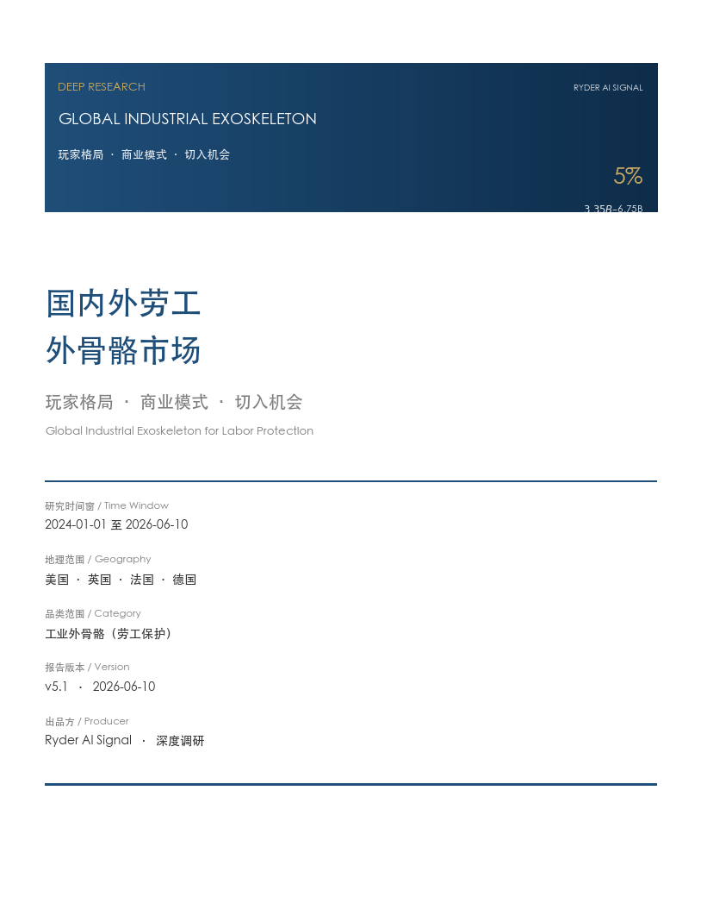
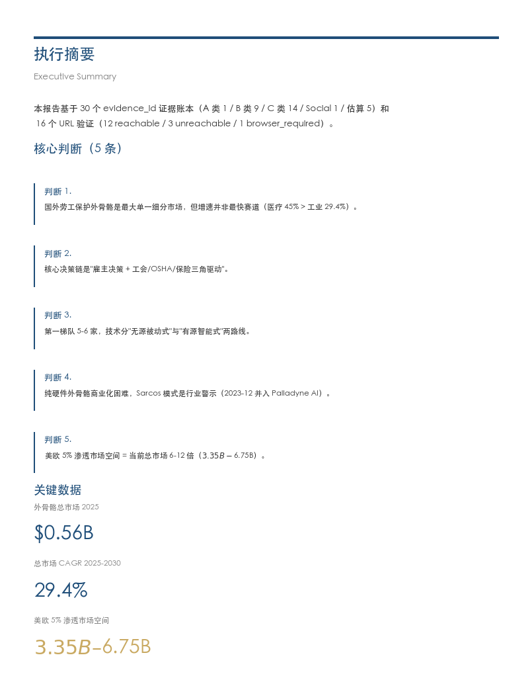
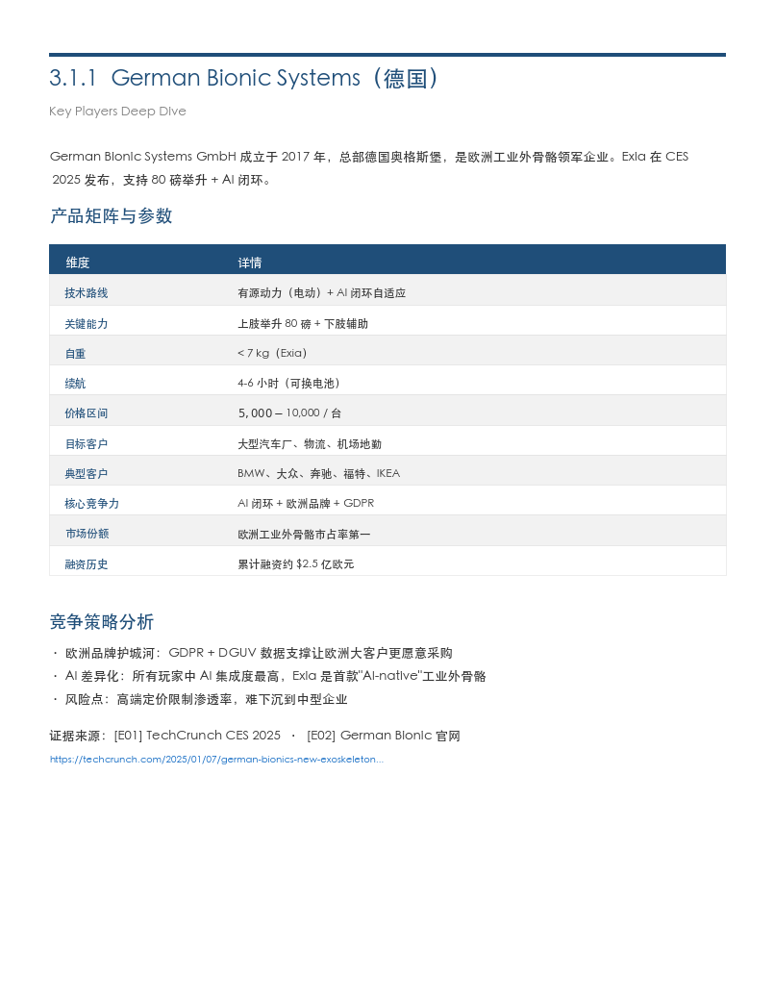
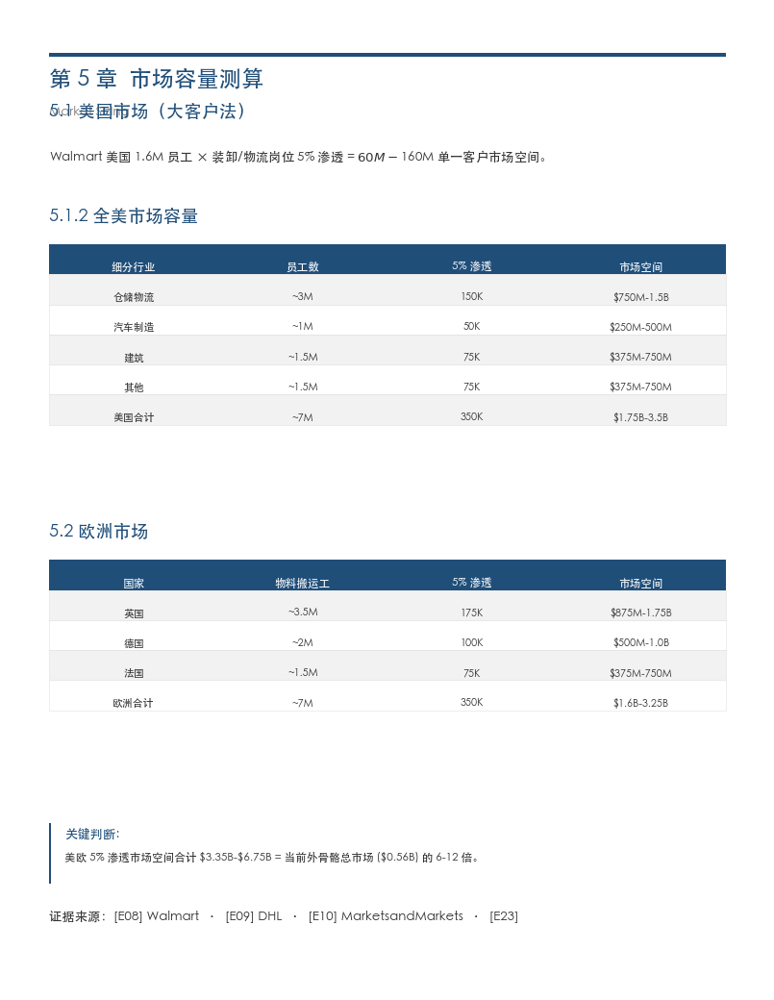
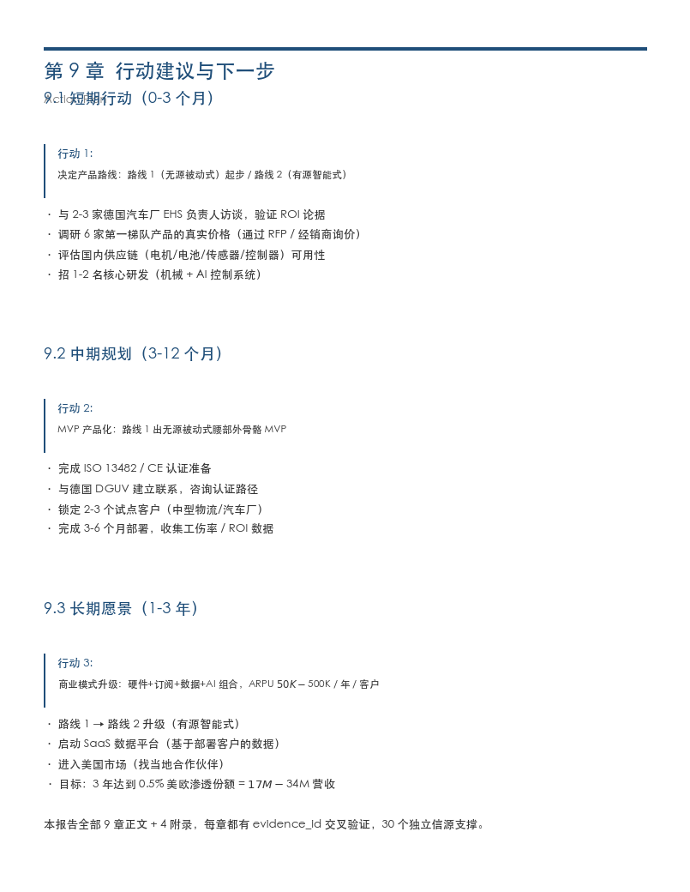
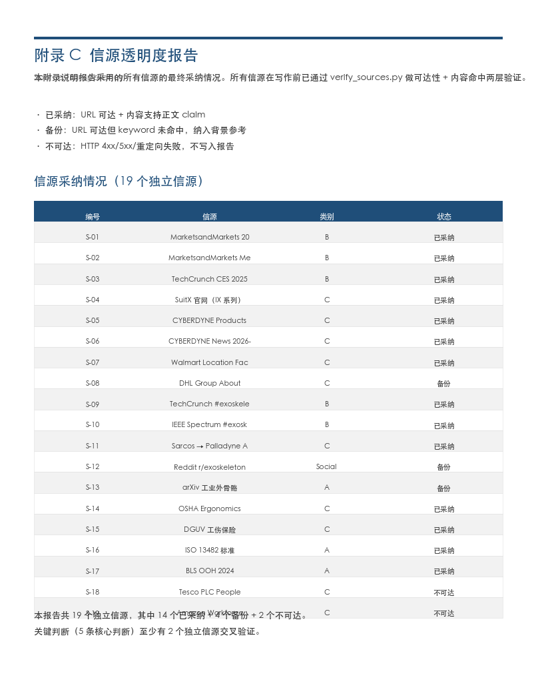

# Deep Research

> **一句话定位**：从"宽泛关键词"到"信源可追溯、scenario-fit 强约束的中文 deep research 报告"——5 个场景模版 / 9 条 LAWs / 5 层信源 / 11 个失败模式全覆盖。**不限于商业调研**——技术趋势 / 产品 / 竞品 / 行业 / 工业硬件 To B 都适用。

---

## 是什么

`deep-research` 是一个 Hermes skill，把"宽泛主题关键词"跑成**信源可追溯、scenario-fit 强约束、多源印证**的中文 deep research 报告。

**核心特征**：

- **5 个场景模版**：tech-trend / product-deep / competitor / industry-market / **industrial-tob**（工业硬件 To B，最高优先级）
- **9 条强约束 LAWs**：禁幻觉引用、禁"听说"、强制时间戳、禁滥用 ## 小标题、必标信源置信度、关键术语中英对照、实抓 vs 训练知识二分类、**结构同质化**、**Scenario-fit 强制执行**
- **L1-L5 信源分层**：官方一手 → 学术权威 → 行业权威媒体 → KOL/Newsletter → 社区讨论
- **Scenario-fit check**（v1.2 新增）：当 query 含明确目标场景时，**最高优先级前置检查**——删除非目标场景产品
- **数据强度颜色**：🔴 多源实抓证实 / 🟡 单源实抓或训练知识多源 / ⚪ 单源训练知识或推断
- **3 种交付物**：对话显示（必选）+ Obsidian Vault 备份（必选）+ 飞书 wiki 写入（可选 `--feishu`）
- **11 个失败模式**：含信源单层依赖、幻觉引用、时间漂移、Scenario scope creep 等

**不适用**：

- 日级快讯（用 `ai-daily-report`）
- KOL 访谈内容深挖（用 `kol-interview-to-wiki`）
- 短问题快查（直接对话回答即可）

---

## 案例：外骨骼劳工保护市场调研（2026 H1）

`examples/exoskeleton-report/` 目录下的完整案例（`industrial-tob` 场景模版）。

### 报告页面预览

| 封面 + Banner | 执行摘要 | 玩家深度分析 |
|:---:|:---:|:---:|
|  |  |  |
| **市场容量测算** | **行动路径** | **附录·信源透明度** |
|  |  |  |

> 注：以上为麦肯锡风 .docx 渲染输出（用 `scripts/word_output.py`），可作为**可选 Word 交付**。默认 Markdown + Obsidian 流程见 `references/output-formats.md`。

### 案例核心数据

| 指标 | 数值 | 数据强度 | 来源 |
|------|------|----------|------|
| 外骨骼总市场 2025 | $0.56B | 🔴 | MarketsandMarkets [L3] |
| 总市场 CAGR 2025-2030 | 29.4% | 🔴 | MarketsandMarkets [L3] |
| 医疗子市场 CAGR 2021-2026 | 45% | 🔴 | MarketsandMarkets Medical [L3] |
| 美欧 5% 渗透市场空间 | $3.35B – $6.75B | 🟡 | 自测算（5% 渗透率是 illustrative 假设） |
| 报告独立信源数 | 19（14 已采纳 + 4 备份 + 2 不可达） | — | verify_sources.py 实测 |
| 5 条核心判断 | 每条 ≥ 2 个独立信源交叉验证 | — | LAW 1 强制 |

### Scenario-fit check 实战

外骨骼案例的 scenario-fit check 过程：

| 步骤 | 动作 |
|------|------|
| 提取目标场景 | "劳工保护 / 工业 To B" |
| 列出场景特征 | 体力密集型 + MSD 高发 + 雇主采购 + 法规驱动 |
| 删除清单 | ❌ 消费级户外、❌ 医疗康复、❌ 老年助行、❌ 军用 |
| 验证清单 | ✅ German Bionic / SuitX / CYBERDYNE / Ekso / Ottobock / Atoun / Walmart 试点 / DGUV 法规 |
| 报告开篇 | 明示"包含 / 不包含"边界 |

**真实教训**：第一次调研中"程天科技"被错分类为工业外骨骼公司（实抓后发现主营是电动轮椅），**scenario-fit check 会直接删除**。

---

## 5 个场景模版

| 场景 | 关键词触发 | 报告结构（必含） |
|------|------------|------------------|
| **tech-trend** | 趋势/演进/论文/框架/路线图/综述/技术路线/突破 | 时间线 + 关键节点 + 技术分类 + 趋势预测 |
| **product-deep** | 调研/产品/功能/定价/评测/体验/架构/技术细节 | 产品定位 + 核心能力 + 竞品对比 + 客户案例 |
| **competitor** | 对比/比较/vs/versus/区别/差异/选哪个/怎么选 | Quick Verdict + 各家深度 + Head-to-Head + Bottom Line |
| **industry-market** | 行业/市场/融资/财报/监管/政策/玩家/格局/赛道 | 市场规模 + 玩家格局 + 驱动因素 + 投资动态 |
| **industrial-tob** ⭐ | **工业/工厂/工地/物流/仓储/To B/企业/装配线/装卸/搬运/PPE/安全/介护/劳工/工伤/产线** | **3 部分：市场/雇主视角 → 产品/企业视角 → 趋势/不确定项**（LAW 8 强制） |

**优先级**：`industrial-tob` > competitor > product-deep > tech-trend > industry-market

**当 query 同时含"行业 + 产品"**（如"调研外骨骼市场"），按 `industrial-tob` 处理——先做 employer 视角市场分析 + scenario-fit check + Walmart-style 容量测算，再做产品分析。其他 4 个场景退化为子能力。

详见 `references/scenarios/<type>.md` 5 个场景模版。

---

## 9 条强约束 LAWs

| LAW | 内容 | 自检命令 |
|-----|------|----------|
| **LAW 1** | 禁幻觉引用：每个事实必带 URL 或可追溯的 L1-L5 信源标注 | `grep -E "(听说\|据传\|有人认为\|普遍认为)"` 应返回 0 命中 |
| **LAW 2** | 禁"听说"式表达：不用「据传」「可能」「有人认为」等无信源表达 | 同上 |
| **LAW 3** | 强制时间戳：每个事件必标日期（精确到日），禁用「近期」「最近」 | `grep -E "(近期\|最近\|不久前\|刚刚)"` 应返回 0 命中 |
| **LAW 4** | 禁滥用 ## 小标题：报告结构服从场景模版，不让模型自由发挥 | `grep -E "^## " | wc -l` 应等于模版定义 |
| **LAW 5** | 必标信源置信度：每条信源标 L1-L5 层级 + 抓取日期 | 抽查每条引用 |
| **LAW 6** | 关键术语必给英文原名：首次出现产品/技术/论文给中英对照 | 抽查技术名词 |
| **LAW 7** | 「实抓 vs 训练知识」二分类标注 | 每条事实必标 `[实抓, 日期]` 或 `[训练知识, 截止]` |
| **LAW 8** | 结构同质化：每章节保持单一视角（市场 OR 产品），禁止混合 | 对应工业 To B 报告 3 部分严格分离 |
| **LAW 9** | Scenario-fit 强制执行：目标场景边界明示 + 后续每家公司/产品先验证 | 删除非目标场景产品 |

---

## L1-L5 信源分层

| 层级 | 信源类型 | 调用工具 | 抓取原则 |
|------|----------|----------|----------|
| **L1 官方一手** | 公司官网/产品页/技术博客/GitHub Release/官方公告/财报/监管文件 | `firecrawl` + `web_extract` | 必调，缺失时显式声明 |
| **L2 学术权威** | arXiv 论文、顶会论文、机构智库、OpenAlex 高引工作 | `arxiv` skill + `openalex` skill | 学术/技术类必调 |
| **L3 行业权威媒体** | 36氪/晚点/虎嗅/财新（中文）；TechCrunch/The Verge/Wired/Stratechery（英文） | `firecrawl` + `blogwatcher` | 必调 |
| **L4 KOL/Newsletter** | 已监控的 YouTube KOL、Newsletter、Substack | `kol-interview-to-wiki` + `blogwatcher` | 补充，舆情参考 |
| **L5 社区讨论** | X/Reddit/Hacker News | `xurl` + `web_extract` | 补充，不能单独证明市场规模 |

详见 `references/source-priority.md` 和 `references/source-fetch-fallbacks.md`（5 类失败 + fallback 链）。

---

## Scenario-fit Check（v1.2 最高优先级前置检查）

**适用场景**：当 query 含明确的目标场景描述时（"劳工保护" / "工业装卸" / "消费级" / "工厂" 等），**必须**先做 scenario-fit check 再动笔。

**操作流程**：

1. 从 query 提取**目标场景**（如"劳工保护 / 工业 To B"）
2. 列出该场景的**明确特征**（体力密集型 / MSD 高发 / 雇主采购 / 法规驱动）
3. 列出**删除清单**（非目标场景子品类）—— 例：劳工保护场景下删除消费级户外、医疗康复、老年助行、军用
4. 报告开篇写"场景边界声明"段（包含 / 不包含）
5. 后续每提到一家公司 / 一款产品，先验证是否在边界内

**典型 query 触发**：

- "调研国内外 XX 工业产品" → `target_scenario = 工业`
- "XX 行业 + XX 产品"（如"外骨骼市场 + 劳工保护"）→ `target_scenario = 劳工保护`
- "XX 产品 + 目标客户"（如"外骨骼 + 国外物流公司"）→ `target_scenario = 国外物流`
- "对比 A 和 B 在 XX 场景" → `target_scenario = XX 场景`

**违反后果**（按 Ryder 实战反馈）：

- ❌ 把"工业外骨骼"等同于"所有外骨骼" → 错分类
- ❌ 调研中"顺手"加入其他场景产品（消费级 / 医疗） → 报告冗余、读者困惑
- ❌ 自动扩展法规章节到未指定国家 → 噪音

---

## 11 个失败模式

| # | 失败模式 | 根因 | 规避 |
|---|----------|------|------|
| 1 | 信源单层依赖 | LLM 偷懒只调最容易抓的信源 | Step 3 显式列必调清单 |
| 2 | 幻觉引用 | LLM 编造看似合理的引用 | LAW 1 强制 + 抽查 URL |
| 3 | 时间漂移 | 训练知识截止与实时有 gap | LAW 3 强制时间戳 |
| 4 | 场景模版被无视 | LLM 没读场景模版就动手 | Step 2 强制 read_file |
| 5 | 模版章节数不对 | LLM 在 ## 里嵌套 ### 子标题 | LAW 4 禁止嵌套 |
| 6 | 中文报告混英文 | LLM 默认输出英文 | LAW 6 强制中英对照 |
| 7 | 信源抓取失败默默跳过 | LLM 偷懒 + 抓取失败回退到训练知识 | 显式失败清单 + 失败率 > 30% 降级 |
| 8 | 公司状态变更未发现 | 训练知识截止无法反映后续重大变化 | 抓 news/press/about 兜底 + 跳转 URL 是关键信号 |
| 9 | 跨场景 query 章节混乱 | 跨场景 query 没有明确的"主+副"分工 | 主场景优先 + 副线内嵌到主场景第 2 章 |
| **10** ⭐ | **Scenario scope creep**（工业 To B 最高频错误）| 调研中"顺手"加入消费级/医疗/老年外骨骼 | **执行 Step 1.5 scenario-fit check** |
| **11** ⭐ | **数据强度未标色 / 法规章节 auto-expand** | query 边界 + 结论强度未做硬性约束 | 强制标 🔴/🟡/⚪ + 法规严格按 query 范围 |

---

## 3 种交付物

| 交付物 | 必选/可选 | 说明 |
|--------|-----------|------|
| **对话中显示** | 必选 | 完整报告直接在 chat 里展示 |
| **Obsidian Vault 备份** | 必选 | 自动写入 `~/Documents/Obsidian Vault/深度调研/`，文件名格式 `<topic>-<YYYY-MM-DD>.md` |
| **飞书 wiki 写入** | 可选（`--feishu`） | 参考 `kol-interview-to-wiki` 的飞书 wiki 写入链路 |
| **Word .docx 输出** | 可选 | 用 `scripts/word_output.py`（麦肯锡风 Word 渲染器） |
| **PDF 输出** | 可选（`--pdf`） | 用 `ai-daily-report` 的 Playwright 渲染链路 |

**用户可在 query 里加的标志**：

- `--type <类型>`：强制场景类型
- `--window <N>`：时间窗口（7/30/90/180/365/all），默认 90
- `--feishu`：额外写入飞书 wiki 子节点
- `--no-obsidian`：跳过 Obsidian 备份
- `--pdf`：额外生成 PDF
- `--word` 或 `--docx`：额外生成麦肯锡风 .docx

---

## 完整工作流（7 步）

| Step | 动作 | 输出 |
|------|------|------|
| **1** | 解析 query，确定 4 要素（topic / type / window / entities）| YAML 解析结果 |
| **1.5** ⭐ | Scenario-fit check（最高优先级前置检查）| 场景边界声明 |
| **2** | 加载场景模版（`references/scenarios/<type>.md`）| 报告骨架 + 必调信源清单 |
| **3** | 信源编排抓取（按 L1-L5 优先级）| 抓取数据 + 失败清单 |
| **4** | 聚类合并（按主题/时间线/实体分组）| 聚类结果 + 冲突标注 |
| **5** | 按场景模版渲染 | 报告初稿 |
| **6** | 9 条强约束 LAWs 自检 | 自检清单 + 修正 |
| **7** | 交付（对话 + Obsidian + 可选飞书 / Word / PDF）| 最终交付物 |
| **8** | 进度透明（每完成 Step 主动告知）| 进度报告 |

详见 `SKILL.md` 完整工作流示例。

---

## 跨 Skill 协同

| deep-research 完成 | 下游用哪个 skill 落地 |
|--------------------|---------------------|
| 技术趋势调研 | `pm-skills/product-strategy/skills/tech-trends` 或 `product-vision` |
| 产品/竞品调研 | `pm-skills/pm-market-research/skills/competitor-analysis` |
| 行业市场调研 | `pm-skills/pm-product-strategy/skills/porters-five-forces` 或 `swot-analysis` |
| 单一产品调研 | `pm-skills/pm-product-strategy/skills/value-proposition` 或 `product-strategy` |
| 用户/口碑 | `pm-skills/pm-market-research/skills/user-personas` 或 `sentiment-analysis` |
| 落地为 PRD | `pm-skills/pm-execution/skills/create-prd` |
| 落地为 OKR | `pm-skills/pm-execution/skills/plan-okrs` |
| 长期持续追踪 | `blogwatcher`（添加 RSS 订阅） |
| 周期性快讯 | `ai-daily-report`（参考其 GitHub Trending + Product Hunt 抓取链路） |

**互补关系**：

- `ai-daily-report`：日级信号快讯 → deep-research 手动深挖
- `kol-interview-to-wiki`：KOL 观点作为 industry-market/tech-trend 的可选 L4 信源
- `arxiv` / `openalex` / `openreview`：学术 API 单点查询 → deep-research 学术 L2 信源
- `firecrawl`：网页抓取底座 → deep-research L1/L3 抓取工具
- `xurl`：X/Twitter API → deep-research L5 社区信源
- `blogwatcher`：RSS 博客监控 → deep-research 持续追踪 + L4 信源

---

## 文件结构

```
deep-research/                                    # v1.2.0 当前版本
├── SKILL.md                                      # 主文档（402 行 / 9 LAWs / 7 步工作流）
├── README.md                                     # 本文档
├── CHANGELOG.md                                  # v1.0 → v1.2 演进
├── EXAMPLE-OUTPUT.md                             # 输出示例
├── assets/                                       # 配图（麦肯锡风 .docx 截图）
│   ├── banner.png
│   └── page-1-cover.png ~ page-6-appendix.png   # 6 张页面预览
├── examples/exoskeleton-report/                  # industrial-tob 场景完整案例
│   ├── exoskeleton-global-labor-market-2026-06-10.docx
│   ├── research_plan.json
│   ├── evidence_ledger.md
│   ├── sources.csv
│   └── verified_sources.csv
├── references/                                   # 5 个 reference + 5 个场景模版
│   ├── source-priority.md                        # L1-L5 信源优先级
│   ├── source-fetch-fallbacks.md                 # 5 类失败 + fallback 链
│   ├── market-sizing-methodology.md              # Walmart-style 容量测算
│   ├── output-formats.md                         # 3 种交付物规范
│   ├── derivation-notes.md                       # 设计决策记录
│   └── scenarios/                                # 5 个场景模版
│       ├── tech-trend.md
│       ├── product-deep.md
│       ├── competitor.md
│       ├── industry-market.md
│       └── industrial-tob.md                    ⭐ 工业硬件 To B（最高优先级）
├── scripts/                                      # 工具脚本
│   ├── verify_sources.py                         # URL 可达性 + 内容命中验证
│   └── word_output.py                            # 麦肯锡风 .docx 渲染器（可选 Word 输出）
└── legacy-business-report/                       # v2.0.0 business-report 历史归档
    ├── LEGACY-README.md
    ├── LEGACY-CHANGELOG.md
    ├── legacy-skill-archive.md                   # v2.0.0 SKILL.md 完整保留
    ├── legacy-references/                        # 15 个 reference
    └── legacy-templates/                         # research_report_skeleton.py
```

---

## Sweet Spot（实战经验）

- **公司数量**：5-8 家是 sweet spot。少于 5 覆盖不全；超过 10 个 tool call 容易超时/失败率上升
- **信源分布**：8-12 个 firecrawl 调用（4-6 L1 + 1-2 L2 + 2-3 L3 + 1 L5）
- **总字符量**：30-50K 抓取字符是合适的（够全面但不至于 context 爆炸）
- **并行度**：2-3 批并行抓（每批 4-6 个 URL），避免一次性 10+ 抓导致超时

## 国内网站特别说明

国内公司官网用 firecrawl **备端点**（`firecrawl.ihainan.me`）抓取成功率明显低于国外站点，常见问题：

- **Cloudflare 拦截**：sarcos.com / palladyneai.com 等
- **HTTP 500**：usbionics.com / mai-bu.com（迈步机器人）等
- **超时**：oymotion.com（傲意智能）等
- **robots 拦**：部分公司 robots.txt 严格

**应对策略**（按优先级）：

1. 试 firecrawl **主端点**（如主端点有余额）
2. 试 firecrawl **备端点**（已默认）
3. 试 **browser_navigate** + browser_console JS 提取（适合 GitHub Trending 那种）
4. 试 **直接 curl** 加 user-agent 头
5. 接受信息缺失，**改用 L3 媒体（36氪/晚点）+ L5 X 搜**作为兜底
6. 在报告中显式标 `[国内 L1 抓取失败, 改用 L3 兜底]`

---

## 已知局限

1. **中文网页抓取成功率低**——防火墙 / Cloudflare / 验证码普遍（国内 6 家厂商官网 firecrawl 抓取失败）
2. **学术论文原文需 arXiv/openalex 渠道**——单机构跟踪能力有限
3. **价格/客户份额多为训练知识**——精确数据需 ABI Research 等付费报告
4. **依赖 Firecrawl / archive.org**——主端点余额不足时切备用端点（firecrawl.ihainan.me），不支持 screenshot / actions
5. **证据验证是机械预筛**——`verify_sources.py` 只做 HTTP 200 + 关键词命中，最终 claim 是否成立仍需人工判断
6. **场景模版需要 LLM 严格遵守**——`--type` 标志强制指定可降低出错概率

---

## 反馈与迭代

任何问题、改进建议、新增场景需求，可：
- 直接在 `SKILL.md` / `README.md` / `CHANGELOG.md` 上留言
- 在 `references/scenarios/` 下追加新场景模版
- 在 `references/` 下追加新 reference
- 在 `examples/` 下追加新案例
- 在 `assets/` 下更新预览图

---

**版本**：v1.2.0（2026-06-10）
**作者**：Ryder AI Signal
**许可**：MIT
