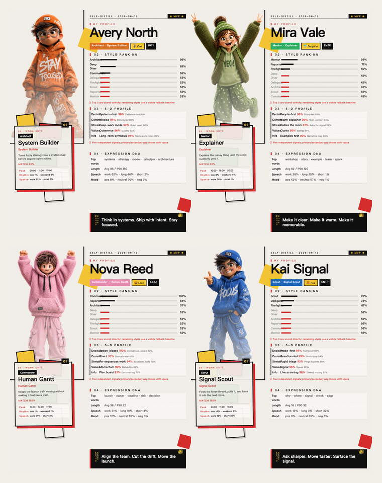

# WorkSelfie

> Not a selfie of your face. A selfie of who you become at work.

[中文 README](README.md)



You work every day, but very few tools show how you actually work.

Maybe you are the person who:

- Turns a messy group chat into a clean action list.
- Says little in the meeting, then writes the plan, risks, and next steps afterward.
- Replies "got it" while quietly reshuffling priorities, unblocking people, and saving the timeline.
- Sends only a few messages, but somehow coordinates half the room.

WorkSelfie lets an agent read the work traces you approve, then turns them into two things: a playful self-analysis report and a shareable 4:5 workplace selfie card.

It is not a questionnaire. It is not another productivity dashboard. It feels more like a coworker who finally notices your hidden operating system: how you talk, when you show up, how you push things forward, how you save the day, and how you work with others.

> "You are not just doing tasks. You have a hidden workplace class."

## What You Get

- A shareable workplace selfie card with a 3D figure, SBTI ranking, expression DNA, and five-dimension personality signals.
- A full written report explaining why the card looks this way, instead of dropping a random label on you.
- A reusable agent skill that can run again for another person, another team, or another slice of work traces.

## The Figure Means Something

WorkSelfie does not pick a random cute character. It matches visible behavior signals to the figure:

- **Orange Focus**: long messages, abstract language, system thinking, deep work energy.
- **Green Energy**: positive tone, teaching-style explanations, warm group communication.
- **Pink Execution**: steady daytime momentum, clear ownership, strong collaboration center.
- **Blue Scout**: short replies, many questions, fast response, group-channel signal scanning.

The card is not decoration. It is your work style translated into a visual character.

## How To Use It

Put this repository into the skills folder of the agent you use. It is not limited to Codex; any agent that supports local `SKILL.md` / skills folders can use the same pattern.

```bash
git clone https://github.com/Ryder-MHumble/work-selfie.git

# Example: copy it into your agent skills folder
mkdir -p ~/.agents/skills
cp -R work-selfie ~/.agents/skills/work-selfie
```

If your agent uses another skills directory, replace `~/.agents/skills` with that path. For example:

```bash
cp -R work-selfie ~/.codex/skills/work-selfie
cp -R work-selfie ~/.claude/skills/work-selfie
```

Restart your agent and say:

```text
Use WorkSelfie to take a selfie of how I work.
```

The agent should first explain what data it wants to read, wait for your confirmation, and save the result locally by default.

## Too Many Chats To Trust One Pull?

Real work is not always a neat 30-day sample. It can be thousands of messages across fires, follow-ups, quiet planning, and "let me check" moments. If an agent tries to read everything in one shot, the context can get truncated and the report only sees the tip of the iceberg.

Use monthly export mode:

```bash
python3 scripts/main.py --provider dws --monthly-export --days 365 --dry-run
```

In this command, `--dry-run` only skips sending and final snapshot updates; the monthly export files are still written locally.

WorkSelfie will page through chat records month by month and write local files like:

```text
~/Downloads/work-selfie/monthly-chat/
├── 2026-01/messages.jsonl
├── 2026-01/monthly-analysis.md
├── 2026-02/messages.jsonl
├── 2026-02/monthly-analysis.md
└── manifest.json
```

Each `monthly-analysis.md` pulls out that month's key work, progress signals, and behavior patterns before the final WorkSelfie report combines the full timeline.

## DingTalk or Lark?

WorkSelfie is not meant to be locked to one office suite. It reads approved work traces through a CLI provider:

- DingTalk teams use `dws`.
- Lark / Feishu teams use the reserved `lark-cli` path.

After installing the skill, ask your agent to check and guide the right CLI setup:

```bash
python3 scripts/bootstrap_cli.py --provider auto --dry-run
```

After reviewing the plan, let the agent run the actual readiness check:

```bash
python3 scripts/bootstrap_cli.py --provider auto
```

If the CLI is missing, the script tells the agent whether to install `dws` or `lark-cli`, or to point `WORKSELFIE_DWS_BIN` / `WORKSELFIE_LARK_BIN` to an existing binary.

If you already know your workplace stack:

```bash
python3 scripts/bootstrap_cli.py --provider dws --dry-run
python3 scripts/bootstrap_cli.py --provider lark --dry-run
```

The `dws` collector is wired today. The `lark-cli` provider, auth flow, and data-source mapping entrypoint are reserved for Lark-based workplaces.

## Just Want The Demo?

You can regenerate the fictional demo cards without connecting real work data:

```bash
cd work-selfie
python3 scripts/generate_demo_cards.py
```

The grid image will be generated at:

```text
examples/cards/demo-grid.png
```

## Who It Is For

- People who wonder what role they really play at work.
- People who want a fun, shareable snapshot of their work style.
- Teams that want a lighter way to understand collaboration styles.
- Agent builders who want to give their assistant a "read me back to myself" capability.
- Anyone who wants boring work traces to become something memorable.

## One-Line Pitch

**WorkSelfie turns your work traces into a shareable workplace selfie card and self-analysis report.**
